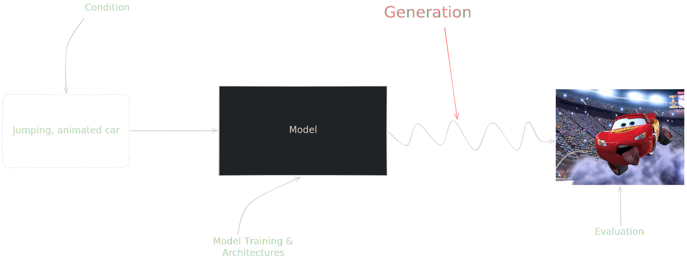
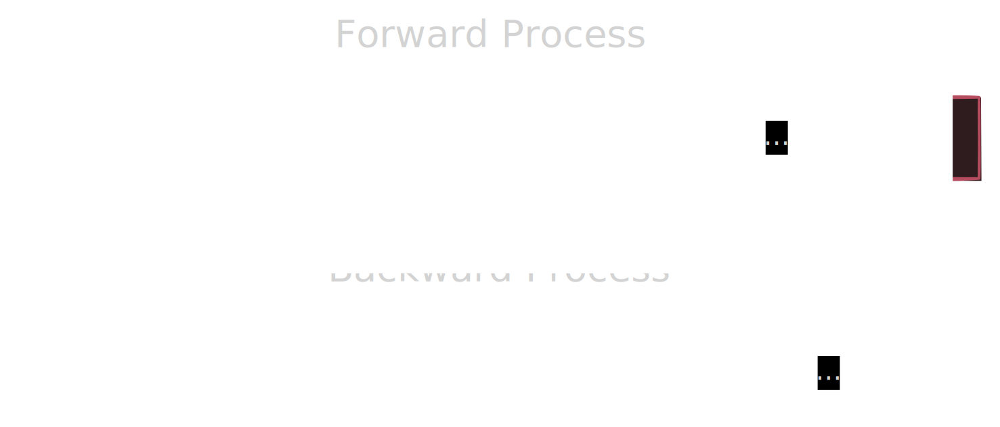
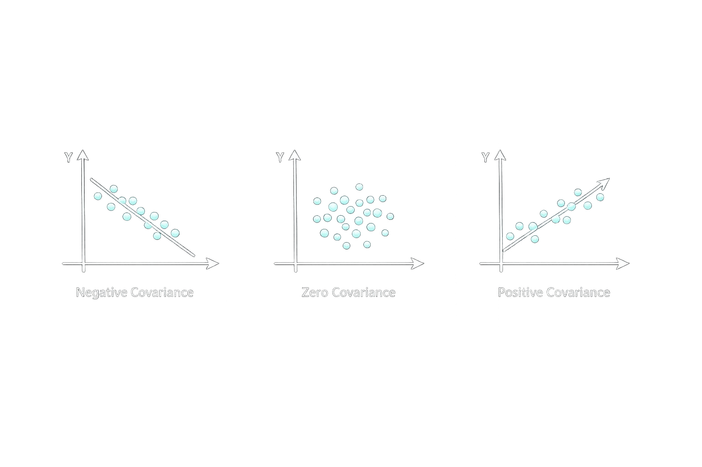
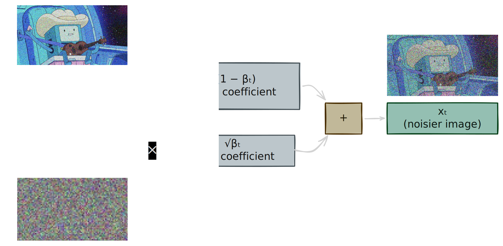

# **Diffusion Notes**

# **Table of Contents**

---

# **0.1 Outline**

- Initial focus will be on the unconditioned generation for simplicity.

  

---

# **0.2 Idea**

- Understand a way to sample an observation from a distribution that is **new**.

  

---

# **0.3 Generate from Noise**

Why start from noise?
- Inherent randomness
- Noise $\sim$ Gaussian and we love Gaussian.
- Surprisingly simple.

---

# **0.4 Intuition**

Starting from $x_0$, input image:
- Add noise $q(x_t \mid x_{t-1})$ for $T$ steps: $x_1, x_2, ..., x_T$.
- Learn the reverse process $p_\theta(x_{t-1} \mid x_t)$ for $T$ steps: $x_T, x_{T-1}, ..., x_0$.

  

---

# **0.5 Dimensionality & Probability Distribution**

There are multiple ways to represent your images. In the end, when we talk about images, we are talking about **vectors**.
So for a 3 channel RGB image: $n = 3 \times H \times W$

$$
x_0 = \begin{pmatrix}
x_{1} \\
x_{2} \\
\vdots \\
x_{n}
\end{pmatrix}
$$

What this means for the distributions we will be working with:
**Single value $\approx$ vector of values.**
$$
x \sim \mathcal{N}(\mu, \Sigma)
$$

$$
\underbrace{
\begin{pmatrix}
x_{1} \\
x_{2} \\
\vdots \\
x_{n}
\end{pmatrix}}_{x}
\sim
\mathcal{N}
\underbrace{
\begin{pmatrix}
\mu_{1} \\
\mu_{2} \\
\vdots \\
\mu_{n}
\end{pmatrix}}_{\mu}
,
\underbrace{
\begin{pmatrix}
\Sigma_{1,1} & \Sigma_{1,2} & \cdots & \Sigma_{1,n} \\
\Sigma_{2,1} & \Sigma_{2,2} & \cdots & \Sigma_{2,n} \\
\vdots & \vdots & \ddots & \vdots \\
\Sigma_{n,1} & \Sigma_{n,2} & \cdots & \Sigma_{n,n}
\end{pmatrix}
}_{\Sigma}
$$

**Note**: The covariance matrix $\Sigma$ is symmetric and we will only focus on **isotropic** Gaussians where:

$$
\Sigma = \sigma^2 I = \begin{pmatrix}
\sigma^2 & 0 & \cdots & 0 \\
0 & \sigma^2 & \cdots & 0 \\
\vdots & \vdots & \ddots & \vdots \\
0 & 0 & \cdots & \sigma^2
\end{pmatrix}
$$

$\sigma^2$ is the variance and $I$ is the identity matrix.

---

# **0.6 Covariance?**

**It is just a quantifier of how two random variables vary in a linear way.**
You may also call this the **joint variability** of two random variables.

  

---

# **1. Forward Process**

- Starting from $x_0$

  

---

# **1.1 Representing Noise**

$$
\epsilon = \begin{pmatrix}
\epsilon_{1} \\
\epsilon_{2} \\
\vdots \\
\epsilon_{n}
\end{pmatrix}
\sim \mathcal{N}(0, I)
$$

$\epsilon_i \sim \mathcal{N}(0, 1)$ is **independent** and **identically distributed**.

---

# **1.2 The Process**

  

---

# **1.3 Details on Forward Process**

At each step, we sample:

$$
q(x_t \mid x_{t-1}) = \mathcal{N}\left(x_t;\sqrt{1-\beta_t}x_{t-1},\beta_t I\right)
$$

- $\beta_t$ controls how much noise is added at step $t$
- small $\beta_t$ → little corruption
- large $\beta_t$ → stronger corruption
- $I$ means independent Gaussian noise per pixel/channel

---

# **2. Backward Process**

---

# **3. Variationality**

---

# **4. Training**

---

# **5. Inference**

---

# **6. Sampling --- **

# **References**

-  **\[1] DDPM**  
  Denoising Diffusion Probabilistic Models  
  https://arxiv.org/abs/2006.11239

-  **\[2] Stanford CME296**  
  Diffusion & Large Vision Models Course  
  https://cme296.stanford.edu/syllabus/

 <!-- Actual referred list using [text][referral_number]  -->

[1]: https://arxiv.org/abs/2006.11239
[2]: https://cme296.stanford.edu/syllabus/
