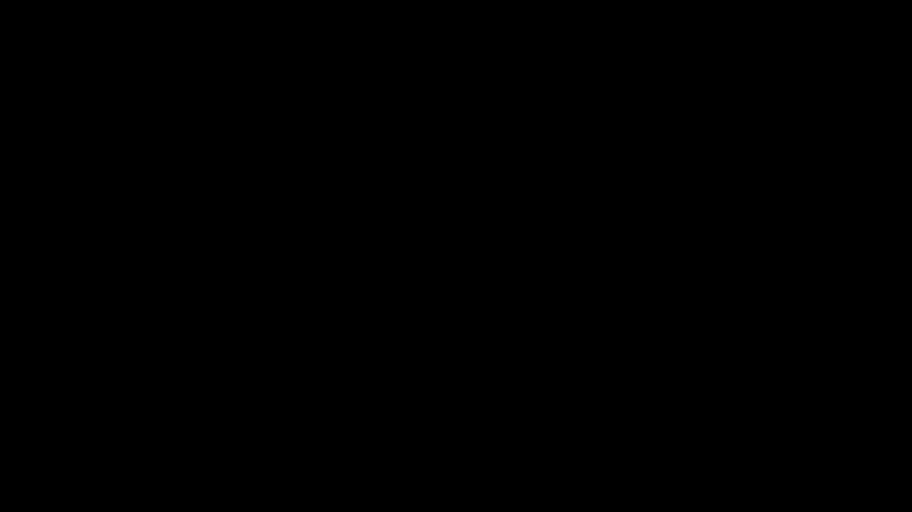

# **Diffusion Notes**

# **Table of Contents**

---

## **0.1 Outline**

- Initial focus will be on the unconditioned generation for simplicity.

  

---

## **0.2 Idea**

- Understand a way to sample an observation from a distribution that is **new**.

  

---

## **0.3 Generate from Noise**

Why start from noise?
- Inherent randomness
- Noise $\sim$ Gaussian and we love Gaussian.
- Surprisingly simple.

---

## **0.4 Intuition**

Starting from $x_0$, input image:
- Add noise $q(x_t \mid x_{t-1})$ for $T$ steps: $x_1, x_2, ..., x_T$.
- Learn the reverse process $p_\theta(x_{t-1} \mid x_t)$ for $T$ steps: $x_T, x_{T-1}, ..., x_0$.

  

---

## **0.5 Dimensionality & Probability Distribution**

There are multiple ways to represent your images. In the end, when we talk about images, we are talking about **vectors**.
So for a 3 channel RGB image: $n = 3 \times H \times W$

$$
x_0 = \begin{pmatrix}
x_{1} \\
x_{2} \\
\vdots \\
x_{n}
\end{pmatrix}
$$

What this means for the distributions we will be working with:
**Single value $\approx$ vector of values.**

$$
x \sim \mathcal{N}(\mu, \Sigma)
$$

$$
\underbrace{
\begin{pmatrix}
x_{1} \\
x_{2} \\
\vdots \\
x_{n}
\end{pmatrix}}_{x}
\sim
\mathcal{N}
\underbrace{
\begin{pmatrix}
\mu_{1} \\
\mu_{2} \\
\vdots \\
\mu_{n}
\end{pmatrix}}_{\mu}
,
\underbrace{
\begin{pmatrix}
\Sigma_{1,1} & \Sigma_{1,2} & \cdots & \Sigma_{1,n} \\
\Sigma_{2,1} & \Sigma_{2,2} & \cdots & \Sigma_{2,n} \\
\vdots & \vdots & \ddots & \vdots \\
\Sigma_{n,1} & \Sigma_{n,2} & \cdots & \Sigma_{n,n}
\end{pmatrix}
}_{\Sigma}
$$

**Note**: The covariance matrix $\Sigma$ is symmetric and we will only focus on **isotropic** Gaussians where:

$$
\Sigma = \sigma^2 I = \begin{pmatrix}
\sigma^2 & 0 & \cdots & 0 \\
0 & \sigma^2 & \cdots & 0 \\
\vdots & \vdots & \ddots & \vdots \\
0 & 0 & \cdots & \sigma^2
\end{pmatrix}
$$

$\sigma^2$ is the variance and $I$ is the identity matrix.

---

## **0.6 Covariance?**

**It is just a quantifier of how two random variables vary in a linear way.**
You may also call this the **joint variability** of two random variables.

  

---

# **1. Forward Process**

- Starting from $x_0$

  

---

## **1.1 Representing Noise**

$$
\epsilon = \begin{pmatrix}
\epsilon_{1} \\
\epsilon_{2} \\
\vdots \\
\epsilon_{n}
\end{pmatrix}
\sim \mathcal{N}(0, I)
$$

$\epsilon_i \sim \mathcal{N}(0, 1)$ is **independent** and **identically distributed**.

---

## **1.2 Single Forward Step**

  

---

## **1.3 Deriving the Forward Process**

At each step, we sample:

$$
q(x_t \mid x_{t-1}) = \mathcal{N}\left(x_t;\sqrt{1-\beta_t}x_{t-1},\beta_t I\right)
$$

- $\beta_t$ controls how much noise is added at step $t$
- small $\beta_t$ → little corruption
- large $\beta_t$ → stronger corruption
- $I$ means independent Gaussian noise per pixel/channel

$$x_t = \sqrt{1-\beta_t}\cdot x_{t-1} + \
\sqrt{\beta_{t}}\cdot\epsilon_t, \quad \epsilon \sim \mathcal{N}(0, I)
$$

After reparameterization, $x_t$ can be expressed in terms of $x_0$ and $\epsilon$;

$$
x_t = \sqrt{\bar\alpha_t}\cdot x_{0} + \
\sqrt{1-\bar\alpha_{t}}\cdot\epsilon, \quad \epsilon \sim \mathcal{N}(0, I)
$$

**But how did we get here?!**

---

## **1.4 Diving Deeper**

Let's define $\alpha_t = 1 - \beta_t$, updated process will become:

$$x_t = \sqrt{\alpha_t}\cdot\underbrace{x_{t-1}}_{\downarrow} + \sqrt{1-\alpha_{t}}\cdot\epsilon_t$$

$$x_{t-1} = \sqrt{\alpha_{t-1}}\cdot{x_{t-2}} + \sqrt{1-\alpha_{t-1}}\cdot\epsilon_{t-1}$$

Replacing $x_{t-1}$ in the first equation:

$$
x_{t} = 
\sqrt{\alpha_t\cdot\alpha_{t-1}}\cdot x_{t-2} + 
\sqrt{\alpha_t\cdot(1-\alpha_{t-1})}\cdot\epsilon_{t-1} + 
\sqrt{1-\alpha_{t}}\cdot\epsilon_t
$$

It actually turns out for any number of independent variables that are drawn from a Gaussian, you can combine the terms together to get a single $\mu$ and $\sigma^2$.

$$x_t = \sqrt{\alpha_t\cdot\alpha_{t-1}}\cdot x_{t-2} + \sqrt\sigma_{combined}\cdot\epsilon$$

**How do we add two independent Gaussian variables together?**

$$\text{Term 1}: \underbrace{\sqrt{\alpha_t\cdot(1-\alpha_{t-1})}}_{\sigma_1}\cdot\epsilon_{t-1}$$

$$\text{Term 2}: \underbrace{\sqrt{1-\alpha_{t}}}_{\sigma_2}\cdot\epsilon_t$$

$$\epsilon_{t-1} \sim \mathcal{N}(0, \sigma_1^2), \quad \epsilon_{t} \sim \mathcal{N}(0, \sigma_2^2) \quad \epsilon_{t-1} \perp \epsilon_t$$

**BIG NOTE: Sum of independent Gaussians variance is the sum of their variances**

$$\sigma^2_{combined} = \sigma_1^2 + \sigma_2^2$$

$$=\alpha_t\cdot(1-\alpha_{t-1}) + (1-\alpha_{t})$$

$$=1-\alpha_t\cdot\alpha_{t-1}$$

Replacing the equation for combined $\sigma^2$ back into the equation for $x_t$:

$$x_t = \sqrt{1-\alpha_t\cdot\alpha_{t-1}}\cdot x_{t-2} + \sqrt{1-\alpha_t\cdot\alpha_{t-1}}\cdot\epsilon$$

If we keep expanding this process, we can generalize that:

$$x_t = \sqrt{\bar\alpha_t}\cdot x_{0} + \sqrt{1-\bar\alpha_{t}}\cdot\epsilon$$

Where:
- $\bar\alpha_t = \prod_{s=1}^t \alpha_s$
- $\epsilon \sim \mathcal{N}(0, I)$

**Key Takeaways**:
- Combining multiple independent Gaussians helped us derive a closed-form expression for $x_t$ in terms of $x_0$ and $\epsilon$.
- We can directly sample $x_t$ at any time step $t$ without any intermediate steps.

---

# **2. Reverse Process**

Going back to the forward-backward diagram:

  

---

## **2.0 Objective**

**We want to learn the $p_\theta$**

$$\max_{\theta} \quad p_\theta(x_0)\rightarrow \text{maximise } p_\theta(x_0)$$

$$\max_{\theta} \quad \log p_\theta(x_0)  
\rightarrow \text{maximise the log-likelihood of } x_0 \text{ under } p_\theta$$

$$\max_{\theta} \quad \mathbb{E}_{q(x_{1:T})}\left[\log p_\theta(x_0)\right]
\rightarrow \text{maximise the expectation of } \log p_\theta(x_0) \text{ over the distribution of } x_{1:T}$$

**Rephrasing**: We want to find the model parameters $\theta$ that maximise the likelihood of the observed data under the model $p$

Note: We are using $\log$ because it has nice properties and provides computational stability.

---

## **2.1 Joint Probability Distributions**

For two probability distributions $x_1$ and $x_2$, we can express their relationship with conditional probabilities:

$p(x_1, x_2)$ is either:

$=\underbrace{p(x_2 \mid x_1)}_{x_2 \text{ given } x_1}\times p(x_1)$

$=\underbrace{p(x_1 \mid x_2)}_{x_1 \text{ given } x_2}\times p(x_2)$

### **2.1.1 Joint Probability Distribution - Marginalization**

  

So, if we want to find the probability distribution of $x_1$ alone, we can marginalize out $x_2$ or vice versa:

$$p(x_1) = \int p(x_1, x_2) dx_2$$

Applying for all the time steps:

  

# **TODO**: ADD 3D VISUAL FOR JOINT PROBABILITY DISTRIBUTION

---

### **2.1.2 Joint Probability Distribution - Summarize**

**Joint Probability Distribution**

$$p(x_1, x_2, \ldots, x_T) = p(x_1) \times p(x_2 \mid x_1) \times \cdots \times p(x_T \mid x_{T-1})$$

**Marginalization**

$$p(x_1) = \int p(x_1, x_2, \ldots, x_T) dx_2 \cdots dx_T $$

**Another notation**: $p(x_1, x_2, \ldots, x_T) = p(x_{1:T})$

---

## **2.2 Back to the Objective**

<b>How to compute?</b>

$$\log p_\theta(x_0)$$

One idea, *marginalization*: $\log p_\theta(x_0) = \log \int p_\theta(x_0, x_{1:T}) dx_{1:T}$

The problem with this is that marginalizing from noise to clean image for all trajectories is not viable to compute.

---

## **2.3 Possible Strategy on how to compute $\log p_\theta(x_0)$**

If you have already heard, this will be about **ELBO** (Evidence Lower Bound).

1. Derive a **lower bound** for the maximum likelihood objective $\log p_\theta(x_0)$.
2. Expand the lower bound terms
3. Show lower bound is **tractable**, meaning solvable in polynomial time at most.
4. Deduce loss function $\Leftrightarrow$ **training objective**

---

## **2.4 ELBO**

1. Derive a **lower bound**

$$\mathbb{E}_{x_0\sim q (x_0)} \left[\log p_\theta (x_0)\right] \underbrace{\geq \mathbb{E}_{x_0\sim q(x_{0:T})} \left(\log \frac{p_\theta(x_{0:T})}{q(x_{1:T} \mid x_{0})} \right)}_{\text{\textbf{ELBO}= \textbf{E}vidence \textbf{Lower} \textbf{BO}und }} $$

A bit scary.

How do we get here?

---

### **2.4.1 Derivation**

Given a clean image, what is the trajectory that is given by $q$ ($q$ as in the forward process)?

$$=q(x_{1:T} \mid x_0)$$

Using this in the objective, to re-write $p_\theta$:

$$p_\theta(x_0) = \int p_\theta(x_{0:T}) dx_{1:T}$$

$$p_\theta(x_0) = \int \frac{p_\theta(x_{0:T}) \times q(x_{1:T} \mid x_0)}{q(x_{1:T} \mid x_0)} dx_{1:T}$$

---

### **2.4.2 General Identity to convert between: $\int \Leftrightarrow \mathbb{E}$**

A probability density function $g(x)$ i.e.

$$\int g(x) dx = 1$$

Expectation of a function $f(x)$ under $g$ is defined as:

$$\mathbb{E}_{g}[f(x)] = \int f(x) g(x) dx$$

---

### **2.4.3 Applying the identity**

$$p_\theta(x_0) = \int \overbrace{\frac{p_\theta(x_{0:T})}{q(x_{1:T} \mid x_0)}}^{f(x)} \times \underbrace{q(x_{1:T} \mid x_0)}_{g(x)} dx_{1:T}$$

Replacing with the expectation definition:

$$= \mathbb{E}_{q(x_{1:T} \mid x_0)}\left[\frac{p_\theta(x_{0:T})}{q(x_{1:T} \mid x_0)}\right]$$

What this this quantity suggests is $p_\theta(x_0)$ corresponds to the expectation of $p_\theta$ over $q$ by **sampling $x_{1:T}$ via the forward process** we have defined.

Where do you go from here?

---

### **2.4.4 Jensen's Inequality**

Jensen's inequality is a commonly used trick that states, for a function $f$ and a random distribution $X$:

If $f$ is convex, then:

$$f(\mathbb{E}[X]) \leq \mathbb{E}[f(X)]$$

If $f$ is concave, then the sign is flipped.

For $f(x) = \log(x)$, we know $\log$ is concave by:

$$f''(x) = -\frac{1}{x^2} < 0 \quad \forall x > 0 $$

So for a random variable $X$, $\log(\mathbb{E}[X]) \geq \mathbb{E}[\log(X)]$

  

---

### **2.4.5 Applying Jensen's Inequality**

$$p_\theta(x_0) = \mathbb{E}_{q(x_{1:T} \mid x_0)}\left[\frac{p_\theta(x_{0:T})}{q(x_{1:T} \mid x_0)}\right]$$

Apply the inequality:

$$\log(p_\theta(x_0)) \geq \mathbb{E}_{q(x_{1:T} \mid x_0)}\left[\log \frac{p_\theta(x_{0:T})}{q(x_{1:T} \mid x_0)}\right]$$

The objective from the start was to maximise $\log p_\theta(x_0)$:

$$\max_{\theta} \; \log p_\theta(x_0)$$

$$\mathbb{E}_{x_0\sim q(x_0)}\left[\log p_\theta(x_0)\right] \geq \ldots$$

Now, we have found a lower bound for the value we wanted to maximise, we can just maximise the lower bound itself ^^.

**Important Note**: So it is quite hard to see but instead of summing through all the possible trajectories, in **ELBO** form, we are only summing trajectories that we are sampling from the forward process.

---

### **2.4.6 What's Next?**

1. **[DONE]** Derive a **lower bound** for the maximum likelihood objective $\log p_\theta(x_0)$.
2. **[TBD]** Expand the lower bound terms
3. **[TBD]** Show lower bound is **tractable**, meaning solvable in polynomial time at most.
4. **[TBD]** Deduce loss function $\Leftrightarrow$ **training objective**

---

## **2.5 Expanding the ELBO**

**2. Expand the terms of lower bound**

---

### **2.5.1 KL Divergence**

Measurement of how one probability distribution $P$ is different from another probability distribution $Q$.

  

We will mostly be working with the continuous KL divergence, which is defined as:

$$D_{KL}(P \parallel Q) = \int p(x) \log \frac{p(x)}{q(x)} dx = \mathbb{E}_{x \sim P} \left[ \log \frac{p(x)}{q(x)} \right]$$

Intuitively:
- $P$ is the true distribution
- $Q$ is the approximation/model
- $\parallel$ indicates comparison of $P$ against $Q$, thus "parallel lines"

---

### **2.5.2 Expanding the Lower Bound Terms**

For the sake of time and current complexity, we will be skipping some of the derivations.
One of them is the expansion of the ELBO, in KL divergence terms:

$$ELBO= -\sum_{t=2}^T D_{KL}(\underbrace{q(x_{t-1} \mid x_t, x_0)}_{\text{tractable?}} \parallel \underbrace{p(x_{t-1} \mid x_t)}_{\text{tractable?}}) +  \text{other terms} $$

**Key Takeaways**:
- The ELBO can be expressed as a sum of KL divergences between the forward process and the reverse process at each time step, plus some additional terms.
- The KL divergence terms measure how closely the reverse process $p_\theta$ approximates the forward process $q$ at each step, given the clean image $x_0$.

---

## **2.6 Show Tractability**

3. Show lower bound is **tractable**:

We need to show both:

1. $q(x_{t-1} \mid x_t, x_0)$ is tractable
2. $p(x_{t-1} \mid x_t)$ is tractable

**For #1:**

Using Bayes' theorem, we can re-express:

$$q(x_{t-1} \mid x_t, x_0) = \frac{q(x_t \mid x_{t-1}, x_0) \overbrace{q(x_{t-1} \mid x_0)}^{\text{tractable}}}{\underbrace{q(x_t \mid x_0)}_{\text{tractable}}}$$

Because $q$ is a Markovian process, we can say that:

$$q(x_t \mid x_{t-1}, x_0) = q(x_t \mid x_{t-1})$$

Which is also closed-form and tractable. Making the whole term **tractable**.

**For #2:**

$p$ is the reverse process that we can choose to be tractable by design.
This can be justified via:
- $x_t$ is sampled from $q$ and we know is tractable
- $q(x_t \mid x_{t-1})$ is also a product of two Gaussians, making $q(x_{t-1} \mid x_t)$ approximately Gaussian over small time steps, thus tractable.

With these in mind, $p_\theta$ could be designed to be a Gaussian distribution sampled w.r.t. $x_t$ and $\theta$.

$$p_\theta(x_{t-1} \mid x_t) = \mathcal{N}(\mu_\theta(x_t), \Sigma_\theta(x_t))$$

---

## **2.7 Deduce Loss Function**

4. Deduce loss function $\Leftrightarrow$ **training objective**

If you replace previously calculated terms into KL Divergence formula, it turns out that most of the terms cancel out and we are left with:

$$\mathcal{L}_{\text{DDPM}} = \mathbb{E}_{t, x_0, \epsilon} \left[\| \epsilon - \epsilon_\theta(\sqrt{\bar\alpha_t} x_t + \sqrt{1 - \bar\alpha_t} \epsilon, t) \|^2 \right]$$

Where variables are sampled as follows:

- $t \sim \mathcal{U}(1, T)$
- $x_0 \sim q(x_0)$
- $\epsilon \sim \mathcal{N}(0, I)$

**Key Points**: Provided a noisy image $x_t$, loss function is an indicator of:

- Computing the noise $\epsilon$ **added** to $x_0$ to get $x_t$.
- Comparing the noise $\epsilon$ with the **noise predicted** by the model $\epsilon_\theta$ given $x_t$ and $t$.

Note: $t$ just states how much noise is added.

---

## **[OPTIONAL] 2.8 Derivation of ELBO to KL Divergence form**

**ELBO after applying Jensen's Inequality**

$$\log p_\theta(x_0) \geq \mathbb{E}_{q(x_{1:T} \mid x_0)} \left[ \log \frac{p_\theta(x_{0:T}, x_0)}{q(x_{1:T} \mid x_0)} \right] $$

**Factorize Reverse Process:**

$$p_\theta(x_{0:T}) = p(x_T) \prod_{t=1}^T p_\theta(x_{t-1} \mid x_t) $$

**Forward Process:**

$$q(x_{1:T} \mid x_0) = \prod_{t=1}^T q(x_t \mid x_{t-1}) $$

**Plug into ELBO formula:**

$$\mathcal{L}=\mathbb{E}_{q} \left[ \log \frac{p(x_T)\times\prod_{t=1}^T p_\theta(x_{t-1} \mid x_t)}{\prod_{t=1}^T q(x_t \mid x_{t-1})} \right] $$

**Apply log properties:**

$$\log(\frac{a\times b}{c}) = \log(a) + \log(b) - \log(c)$$

and

$$\log \prod_{t=1}^T a_t = \sum_{t=1}^T \log(a_t)$$

**So the ELBO becomes**

$$\mathcal{L}= \mathbb{E}_{q} \left[ \log p(x_T) + \sum_{t=1}^T \log p_\theta(x_{t-1} \mid x_t) - \sum_{t=1}^T \log q(x_t \mid x_{t-1}) \right] $$

Rearrange terms considering the forward chain below:

$$q(x_{1:T} \mid x_0) = q(x_T \mid x_0)\prod_{t=2}^T q(x_{t-1} \mid x_t, x_0) $$

Plugging this into the ELBO formula:

$$\mathcal{L} = \mathbb{E}_{q} \left[ \log \frac{p(x_T)}{q(x_T \mid x_0)} + \sum_{t=2}^T \log \frac{p_\theta(x_{t-1} \mid x_t)}{q(x_{t-1} \mid x_t, x_0)} + \log p_\theta(x_0 \mid x_1) \right] $$

**Use the definition of KL Divergence:**

$$D_{\text{KL}}(q \parallel p) = \mathbb{E}_q \left[ \log \frac{q}{p} \right] $$

Therefore,

$$\mathbb{E}_{q} \left[ \log \frac{p_\theta(x_{t-1} \mid x_t)}{q(x_{t-1} \mid x_t, x_0)} \right] = -D_{\text{KL}}(q(x_{t-1} \mid x_t, x_0) \parallel p_\theta(x_{t-1} \mid x_t))$$

**So final form of ELBO becomes:**

$$
\boxed{
\mathcal{L} = \underbrace{-\sum_{t=2}^T D_{\text{KL}}(q(x_{t-1} \mid x_t, x_0) \parallel p_\theta(x_{t-1} \mid x_t))}_{\text{lower bound terms}} + \underbrace{\mathbb{E}_{q(x_1 \mid x_0)} \left[ \log p_\theta(x_0 \mid x_1) \right] - D_{\text{KL}}(q(x_T \mid x_0) \parallel p(x_T))
}_{\text{other terms}}}
$$

---

# **3. What has been covered so far?**

## **3.1 Forward Process ($q$)**

- Fixed, Gaussian, Markov chain that gradually adds noise to data:
  
  $$q(x_t \mid x_{t-1}) = \mathcal{N}(x_t;\sqrt{1-\beta_t}x_{t-1}, \beta_t I)$$

- Can be expressed in closed form:

  $$x_t = \sqrt{\bar{\alpha}_t} x_0 + \sqrt{1 - \bar{\alpha}_t}\epsilon$$

- Key properties:
  - Adds Gaussian noise progressively
  - Leads to $x_T \approx \mathcal{N}(0, I)$
  - Closed form and fully tractable sampling

---

## **3.2 Reverse Process ($p_\theta$)**

- Learned Markov chain that denoises:

  $$p_\theta(x_{t-1} \mid x_t) = \mathcal{N}(\mu_\theta(x_t, t), \Sigma_\theta(x_t, t))$$

- Objective:
  - Approximate the true reverse distribution of the forward process

- Training signal:
  - Derived via ELBO → KL minimization
  - Minimize the expectation of the L2 distance between true and predicted noise at arbitrary time steps: 

  $$\mathcal{L} = \mathbb{E}_{t, x_0, \epsilon} \left[\|\epsilon - \epsilon_\theta(x_t, t)\|^2\right]$$

---

# **3. Training**

---

# **4. Inference**

---

# **References**

-  **\[1] DDPM**  
  Denoising Diffusion Probabilistic Models  
  https://arxiv.org/abs/2006.11239

-  **\[2] Stanford CME296**  
  Diffusion & Large Vision Models Course  
  https://cme296.stanford.edu/syllabus/

-  **\[3] Intelligent Systems Lab**
  Video lectures on probability, distributions, and related topics.
  https://www.youtube.com/@intelligentsystemslab907/videos

-  **\[4] Jensen's Inequality**  
  https://en.wikipedia.org/wiki/Jensen%27s_inequality

-  **\[5] KL Divergence**  
  Kullback–Leibler divergence  
  https://en.wikipedia.org/wiki/Kullback%E2%80%93Leibler_divergence

 <!-- Actual referred list using [text][referral_number]  -->

[1]: https://arxiv.org/abs/2006.11239
[2]: https://cme296.stanford.edu/syllabus/
[3]: https://www.youtube.com/@intelligentsystemslab907/videos
[4]: https://en.wikipedia.org/wiki/Jensen%27s_inequality
[5]: https://en.wikipedia.org/wiki/Kullback%E2%80%93Leibler_divergence