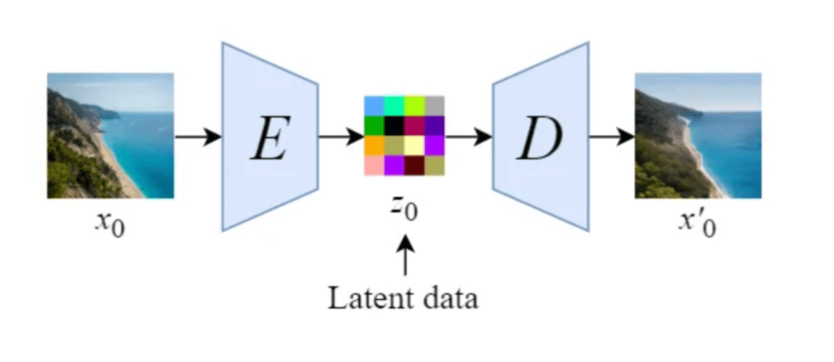
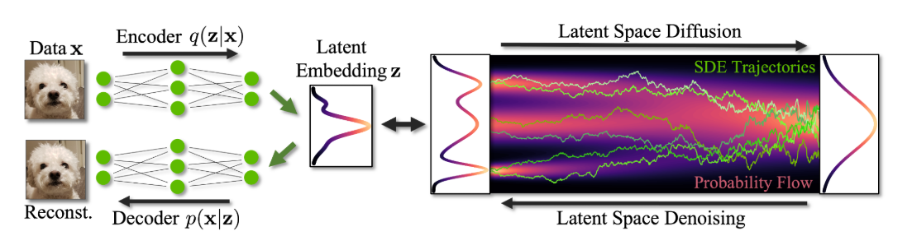
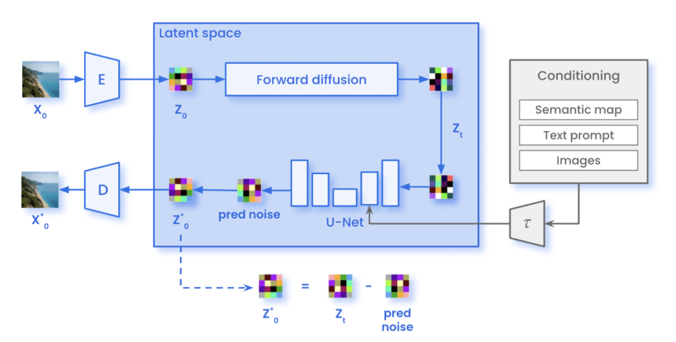

# **Latent Diffusion Models Notes**

---

# **Table of Contents**

- [0. Idea](#0-idea)
- [1. Why Latent Space?](#1-why-latent-space)
- [2. Autoencoder / VAE Stage](#2-autoencoder--vae-stage)
  - [2.1 What the Encoder Does](#21-what-the-encoder-does)
  - [2.2 What the Decoder Does](#22-what-the-decoder-does)
  - [2.3 Autoencoder Training](#23-autoencoder-training)
- [3. Latent Diffusion Stage](#3-latent-diffusion-stage)
  - [3.1 Training](#31-training)
  - [3.2 Inference](#32-inference)
- [4. Conditioning](#4-conditioning)
- [5. Evaluation](#5-evaluation)
  - [5.1 Autoencoder Evaluation](#51-autoencoder-evaluation)
  - [5.2 Generation Evaluation](#52-generation-evaluation)
  - [5.3 Conditioning Evaluation](#53-conditioning-evaluation)
- [6. Practical Failure Modes](#6-practical-failure-modes)
- [7. Summary](#7-summary)
- [References](#references)

---

# **0. Idea**

Latent Diffusion Models (LDMs) are diffusion models that do **not** run the diffusion process directly in pixel space.

Instead, they use a learned compressed representation:

```text
image x
  ↓
encoder
  ↓
latent z
  ↓
sampler / denoiser
  ↓
decoder
  ↓
generated image
```

The main point:

> Train the expensive generative model in a smaller latent space, then decode the generated latent back to pixels.

This is the central idea behind models such as Stable Diffusion.



---

# **1. Why Latent Space?**

A naive image representation uses all pixels:

$$
x_{\text{image}} \in \mathbb{R}^{H \times W \times C}
$$

For a large image, this is very high-dimensional.

For example:

```text
1024 × 1024 × 3 ≈ 3 million values
```

Pixel space has three major issues:

1. **High dimensionality**
2. **Redundant information**
3. **Weak semantic structure**




Neighboring pixels are strongly correlated, and small movements in pixel space do not necessarily correspond to meaningful image changes.

A better space should be:

- smaller
- compact
- meaningful
- still reconstructable

Latent space tries to satisfy this.

---

# **2. Autoencoder Stage**

Before training the diffusion model, LDMs first train an image representation model.

Usually this is an autoencoder or VAE-like model.

```text
pixel image x
  ↓
encoder q(z | x)
  ↓
latent z
  ↓
decoder p(x | z)
  ↓
reconstruction x_hat
```

The autoencoder is trained to compress the image while preserving the information needed for reconstruction.

---

## **2.1 What the Encoder Does**

The encoder maps an image to a smaller latent tensor:

```text
x → z
```

Example:

```text
pixel image:  3 × 512 × 512
latent:       4 × 64 × 64
```

This is much cheaper for a diffusion model.

The encoder usually behaves like a **low-pass filter**:

- it preserves global structure
- it removes some high-frequency pixel detail
- it produces a compressed representation

---

## **2.2 What the Decoder Does**

The decoder maps the latent representation back to image space:

```text
z → x_hat
```

The decoder is responsible for reconstructing visual details.

In practice, this means the decoder often has to recover or hallucinate:

- texture
- edges
- local details
- fine image statistics

This is why the decoder quality matters a lot. A weak decoder can make generated images blurry or artifact-heavy, even if the latent diffusion model is good.

---

## **2.3 Autoencoder Training**

The first training stage is:

```text
train encoder + decoder
```

The basic reconstruction objective is:

$$
x \approx \hat{x}
$$

In practice, autoencoder training often combines several terms:

| Loss | Purpose | Risk if too strong |
|---|---|---|
| Reconstruction loss | preserve pixel-level content | blurry outputs |
| KL regularization | structure the latent space | posterior collapse |
| Perceptual loss | preserve human-visible structure | checkerboard / texture artifacts |
| Adversarial loss | make outputs look realistic | mode collapse |

A practical VAE / autoencoder objective is usually a weighted combination:

```text
total loss =
    reconstruction
  + latent regularization
  + perceptual loss
  + optional adversarial loss
```

The goal is not only to reconstruct images numerically, but to produce latents that are useful for generation.

---

# **3. Latent Diffusion Stage**

After the autoencoder is trained, it is usually frozen.

Then the diffusion model is trained in latent space.

```text
image x
  ↓ frozen encoder
latent z
  ↓ add noise
noisy latent z_t
  ↓ denoiser
predicted noise / velocity / score
```



The important change is:

```text
pixel diffusion:  diffusion model sees noisy images
latent diffusion: diffusion model sees noisy latents
```

This makes training and inference much cheaper.

---

## **3.1 Training**

Training procedure:

1. Take an image from the dataset.

```text
x ~ p_data
```

2. Encode it with the frozen encoder.

```text
z = Encoder(x)
```

3. Sample noise.

```text
epsilon ~ N(0, I)
```

4. Add noise to the latent.

```text
z_t = noisy version of z
```

5. Feed the noisy latent to the denoiser.

```text
denoiser(z_t, t, condition)
```

6. Train the model to predict the target.

Depending on the formulation, the target can be:

- noise
- score
- velocity

For a DDPM-style latent diffusion model, the most common target is noise:

```text
model input:  noisy latent z_t, time t, condition c
model target: noise epsilon
```

The core training loop is:

```python
for image, condition in dataloader:
    z = encoder(image).detach()

    t = sample_timestep()
    noise = randn_like(z)
    z_t = add_noise(z, noise, t)

    pred_noise = denoiser(z_t, t, condition)

    loss = mse(pred_noise, noise)
    loss.backward()
    optimizer.step()
```

The encoder is frozen during this stage.

---

## **3.2 Inference**

Inference starts from random latent noise:

```text
z_T ~ N(0, I)
```

Then the model iteratively denoises in latent space:

```text
z_T → z_{T-1} → ... → z_0
```

Finally, the VAE decoder maps the clean latent to pixels:

```text
generated image = Decoder(z_0)
```

So the full inference pipeline is:

```text
prompt / condition
  ↓
conditioning encoder
  ↓
latent denoising process
  ↓
VAE decoder
  ↓
image
```

The decoder is only used at the end.

---

# **4. Conditioning**

LDMs can be conditioned on different modalities:

- text
- class labels
- images
- segmentation maps
- depth maps
- bounding boxes

For text-to-image models, the condition usually comes from a text encoder.

```text
prompt
  ↓
tokenizer
  ↓
text encoder
  ↓
text embedding
  ↓
cross-attention inside denoiser
```

The denoiser receives both:

```text
noisy latent z_t
condition embedding c
```

and learns to generate latents consistent with the condition.

In Stable Diffusion-like models, text usually influences generation through **cross-attention** layers inside the U-Net.

---

# **5. Evaluation**

Evaluation should be split into three parts:

1. autoencoder quality
2. generation quality
3. conditioning quality

This separation is important because a bad final image can come from different sources:

```text
bad decoder?
bad latent diffusion model?
bad conditioning?
bad sampler?
```

---

## **5.1 Autoencoder Evaluation**

Before evaluating generation, evaluate the VAE / autoencoder.

### Reconstruction Grid

Compare:

```text
original image vs reconstructed image
```

This quickly reveals:

- blur
- loss of texture
- color shifts
- shape distortion
- checkerboard artifacts

### Reconstruction Metrics

Common metrics:

| Metric | Measures |
|---|---|
| MSE / L1 | pixel-level difference |
| PSNR | pixel reconstruction fidelity |
| SSIM | structural similarity |
| LPIPS | perceptual similarity |

For LDMs, LPIPS is often more meaningful than pure pixel MSE because it better reflects perceived visual quality.

### Latent Statistics

Check whether encoded latents are stable:

- latent mean
- latent standard deviation
- latent value range
- channel-wise statistics

This matters because the diffusion model will be trained on these latent distributions.

---

## **5.2 Generation Evaluation**

Generation evaluation asks:

> Are generated samples realistic, diverse, and close to the data distribution?

Common metrics:

| Metric | Purpose |
|---|---|
| FID | distribution-level image quality |
| Precision / Recall | fidelity vs diversity |
| Inception Score | rough quality/diversity proxy |
| nearest-neighbor checks | memorization detection |
| human inspection | qualitative failures |

### FID

FID compares statistics of generated images and real images in a feature space.

Lower FID is usually better.

However:

- it depends on sample count
- it is dataset-sensitive
- it can miss prompt-specific failures
- it should not be the only metric

### Diversity

A model can generate sharp images but still be poor if it always generates similar outputs.

Check:

- visual diversity
- class diversity
- prompt diversity
- latent diversity
- repeated patterns

### Memorization Check

For generated images, compare against nearest training samples.

This helps detect whether the model is generating new samples or copying training data.

---

## **5.3 Conditioning Evaluation**

For conditional generation, image quality alone is not enough.

You also need to evaluate:

```text
does the image match the condition?
```

For text-to-image:

| Metric / Check | Purpose |
|---|---|
| CLIPScore | text-image alignment |
| prompt-following tests | qualitative prompt adherence |
| object counting tests | compositional ability |
| style / attribute tests | controllability |
| human preference | subjective quality |

Examples:

```text
Prompt: "a red cube on a blue table"
Check:
- is there a cube?
- is it red?
- is the table blue?
- are the objects spatially correct?
```

Many models can generate visually good images while still failing at detailed prompt adherence.

---

# **6. Practical Failure Modes**

## **6.1 Autoencoder Bottleneck Too Strong**

If the latent space is too compressed:

- reconstructions lose detail
- generated images look washed out
- small objects disappear

## **6.2 Weak Decoder**

If the decoder is weak:

- textures look poor
- images become blurry
- artifacts appear after decoding

## **6.3 Poor Latent Scaling**

Latent diffusion models are sensitive to latent magnitude.

If latents are not scaled consistently:

- training becomes unstable
- sampler behavior worsens
- generated images may collapse or become noisy

## **6.4 Overweighting Regularization**

Too much KL regularization can make the latent representation less informative.

This can lead to posterior collapse-like behavior.

## **6.5 Bad Conditioning**

If the condition encoder or cross-attention is weak:

- prompts are ignored
- attributes are mixed
- object relationships fail
- generated image quality may still look good, but alignment is poor

---

# **7. Summary**

## **7.1 Main Idea**

LDMs move diffusion from pixel space to latent space.

```text
pixels → latent → diffusion → latent → pixels
```

This makes training and inference cheaper.

---

## **7.2 Training**

Training has two stages:

```text
Stage 1:
train autoencoder / VAE

Stage 2:
freeze autoencoder
train diffusion model on latents
```

The diffusion model learns to denoise compressed latent representations instead of full-resolution images.

---

## **7.3 Inference**

Inference:

```text
sample latent noise
denoise in latent space
decode latent to image
```

Only the final latent is decoded into pixels.

---

## **7.4 Evaluation**

Evaluate separately:

```text
autoencoder reconstruction
generation quality
condition alignment
sampling efficiency
```

This helps identify where failures actually come from.

---

# **References**

- <a id="ldm"></a> **[1] High-Resolution Image Synthesis with Latent Diffusion Models**  
  Robin Rombach, Andreas Blattmann, Dominik Lorenz, Patrick Esser, Björn Ommer  
  https://arxiv.org/abs/2112.10752

- <a id="vae"></a> **[2] Auto-Encoding Variational Bayes**  
  Diederik P. Kingma, Max Welling  
  https://arxiv.org/abs/1312.6114

- <a id="lpips"></a> **[3] The Unreasonable Effectiveness of Deep Features as a Perceptual Metric**  
  Richard Zhang, Phillip Isola, Alexei A. Efros, Eli Shechtman, Oliver Wang  
  https://arxiv.org/abs/1801.03924

- <a id="gan"></a> **[4] Generative Adversarial Networks**  
  Ian Goodfellow et al.  
  https://arxiv.org/abs/1406.2661
