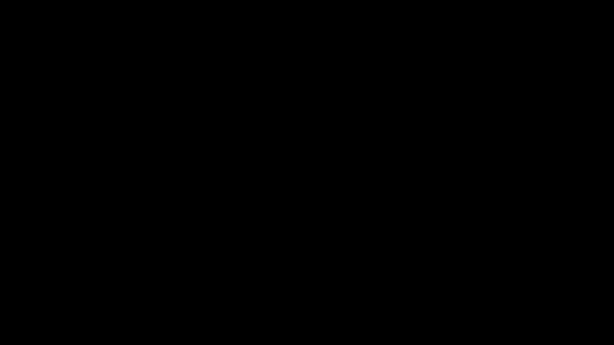

# **Score Matching Notes**

---

# **Table of Contents**

- [0. Idea](#0-idea)
- [1. Score Function](#1-score-function)
  - [1.1 Key Intuition for Score Functions](#11-key-intuition-for-score-functions)
- [2. Score Matching Objective](#2-score-matching-objective)
- [3. Denoising Score Matching](#3-denoising-score-matching)
- [4. Connection to Diffusion Models](#4-connection-to-diffusion-models)
- [5. Summary](#5-summary)
- [References](#references)

---

# **0. Idea**

In generative modeling, we want to learn the data distribution:

$$
p_{\text{data}}(x)
$$

But directly learning this density can be difficult.

Instead of learning the full probability density, **score matching** learns the direction in which the density increases.

In other words:

> Given a noisy or corrupted sample, learn how to move it toward more likely data regions.

---

# **1. Score Function**

The **score function** is defined as:

$$
\nabla_x \log p(x)
$$

This tells us how the log-probability changes with respect to the input $x$.

Intuitively:

- If $x$ is in a low-density region, the score points toward a higher-density region.
- If $x$ is already likely under the data distribution, the score becomes smaller.
- The score does **not** give the probability directly; it gives the **direction of improvement**.

So instead of modeling:

$$
p(x) \Rightarrow \nabla_x p(x)
$$

For purposes of numerical stability and tractability (again!), we model by taking its logarithm:

**Score Function**

$$
\boxed{s_\theta(x) \approx \nabla_x \log p(x)}
$$

Logarithm of $p(x)$ still points in the same direction as $p(x)$ as:

$$\nabla \log p(x) = \frac{\nabla p(x)}{p(x)}$$

## **1.1 Key Intuition for Score Functions**:

  

---

# **2. Score Matching Objective**

The ideal objective would be:

$$
\mathcal{L}_{\text{SM}}=\mathbb{E}_{x \sim p_{\text{data}}}
\left\|
s_\theta(x) - \nabla_x \log p_{\text{data}}(x)
\right\|^2
$$

Meaning:

- $s_\theta(x)$ is the model-predicted score.
- $\nabla_x \log p_{\text{data}}(x)$ is the true score.
- We train the model to predict the true score.

However, there is one problem:

$$
\nabla_x \log p_{\text{data}}(x)
$$

is usually unknown.

So we need a more practical version.

---

# **3. Denoising Score Matching**

Instead of using clean data directly, we add Gaussian noise:

$$
\tilde{x} = x + \sigma \epsilon,
\quad
\epsilon \sim \mathcal{N}(0, I)
$$

Now the model learns how to move the noisy sample $\tilde{x}$ back toward the clean sample $x$.

For Gaussian corruption, the target score becomes tractable:

$$
\nabla_{\tilde{x}} \log q(\tilde{x} \mid x) = -\frac{\tilde{x} - x}{\sigma^2}
$$

So the denoising score matching objective becomes:

$$\boxed{\mathcal{L}_{\text{DSM}} = \mathbb{E}_{x, \tilde{x}}
\left\|
s_\theta(\tilde{x}, \sigma)
+
\frac{\tilde{x} - x}{\sigma^2}
\right\|^2}
$$

**Key intuition**:

The model receives a noisy sample and learns the direction that removes the noise.

---

# **4. Connection to Diffusion Models**

In DDPMs, we define a noisy sample as:

$$x_t = \sqrt{\bar{\alpha}_t}x_0 + \sqrt{1-\bar{\alpha}_t}\epsilon$$

The DDPM model is often trained to predict the noise:

$$
\epsilon_\theta(x_t, t)
$$

with loss:

$$
\mathcal{L}_{\text{DDPM}} = \mathbb{E}_{t, x_0, \epsilon}
\left\|
\epsilon - \epsilon_\theta(x_t, t)
\right\|^2
$$

This is closely related to score matching.

For the noisy distribution $q(x_t \mid x_0)$, the score is proportional to the noise direction:

$$
\nabla_{x_t} \log q(x_t \mid x_0) = -\frac{1}{\sqrt{1-\bar{\alpha}_t}}\epsilon
$$

So predicting noise is basically another way of learning the score.

That is why diffusion models can be seen as **score-based generative models**.

  

---

# **5. Summary**

## **5.1 Score Matching**

- Learns:

$$
\nabla_x \log p(x)
$$

- Instead of learning the probability density directly.
- The score tells us the direction toward higher probability.

---

## **5.2 Denoising Score Matching**

- Add Gaussian noise to data.
- Train the model to predict the direction back to clean data.
- This makes the score objective tractable.

---

## **5.3 Relation to DDPM**

- DDPM predicts noise:

$$
\epsilon_\theta(x_t, t)
$$

- Score matching predicts the gradient of log-density:

$$
s_\theta(x_t, t) \approx \nabla_{x_t} \log p_t(x_t)
$$

- These are closely connected because the noise direction determines the score direction.

---

# **References**

-  **[1] Score Matching**  
  Aapo Hyvärinen, Estimation of Non-Normalized Statistical Models by Score Matching  
  https://jmlr.org/papers/v6/hyvarinen05a.html

-  **[2] Denoising Score Matching**  
  Pascal Vincent, A Connection Between Score Matching and Denoising Autoencoders  
  https://www.iro.umontreal.ca/~vincentp/Publications/smdae_techreport.pdf

-  **[3] Score-Based Generative Modeling**  
  Yang Song et al., Score-Based Generative Modeling through Stochastic Differential Equations  
  https://arxiv.org/abs/2011.13456

-  **[4] DDPM**  
  Denoising Diffusion Probabilistic Models  
  https://arxiv.org/abs/2006.11239
